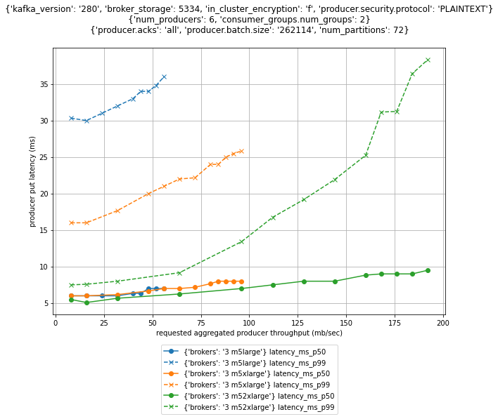
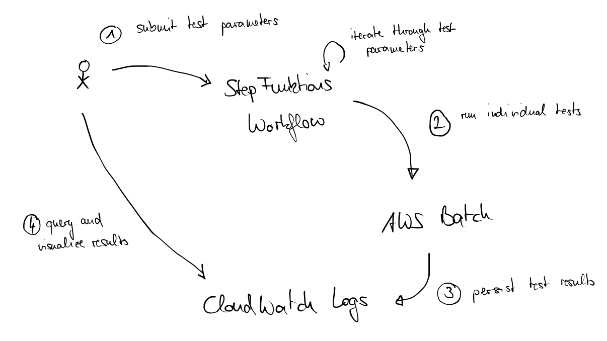

## Performance Testing Framework for Apache Kafka


*******
WARNING: This code is NOT intended for production cluster. It will delete topics on your clusters. Only use it on dedicated test clusters.
*******

The tool is designed to evaluate the maximum throughput of a cluster and compare the put latency of different broker, producer, and consumer configurations. To run a test, you basically specify the different parameters that should be tested and the tool will iterate through all different combinations of the parameters, producing a graph similar to the one below.



## Configure Local Enviroment

The framework is based on the `kafka-producer-perf-test.sh` and `kafka-consumer-perf-test.sh` tools that are part of the Apache Kafka distribution. It builds automation and visualization around these tools leveraging AWS services such as AWS Step Functions for scheduling and AWS Batch for running individual tests.



You just need to execute the AWS CDK template in the `cdk` folder of this repository to create the required resource to run a performance test. The [create environment](docs/create-env.md) section contains details on how to install the dependencies required to successfully deploy the template. It also explains how to configure an EC2 instance that matches all prerequisites to execute the template successfully.

Once your environment is configured, you need to adapt the `defaults` variable in `bin/cdk.ts` so that it matches your account details.

```node
const defaults : { 'env': Environment } = {
  env: {
      account: '123456789012',
      region: 'eu-west-1'
  }
};
```

Finally, you need to install all dependencies of the CDK template by running the following command in the `cdk` folder.

```bash
# Install CDK template dependencies
npm install
```

## Choose MSK Cluster Configuration

The CDK template can either create a fresh new MSK cluster for the performance tests or you can specify your precreated cluster. The framework is creating and deleting topics on the cluster to run the performance tests, so it's highly recommended to use a dedicated cluster to avoid any data loss.

To create a new cluster, you need to specify the respective cluster configuration. 

```node
new CdkStack(app, 'stack-prefix--', {
  ...defaults,
  vpc: vpc,
  clusterProps: {
    numberOfBrokerNodes: 1,
    instanceType: InstanceType.of(InstanceClass.M5, InstanceSize.LARGE),
    ebsStorageInfo: {
      volumeSize: 5334
    },
    encryptionInTransit: {
      enableInCluster: false,
      clientBroker: ClientBrokerEncryption.PLAINTEXT
    },
    kafkaVersion: KafkaVersion.V2_8_0,
  }
});
```

Alternatively, you can specify an existing cluster instead.

```node
new CdkStack(app, 'stack-prefix--', {
  ...defaults,
  vpc: vpc,
  clusterName: '...',
  bootstrapBrokerString: '...',
  sg: '...',
});
```

You can then deploy the CDK template to have it create the respectice resource into your account.

```bash
# List the available stacks
cdk list

# Deploy a specific stack
cdk deploy stack-name
```

Note that the created resources will start to incur cost, even if no test is executed. `cdk destroy` will remove most resources again. It will retain a CloudWatch log streams that contain the experiment output to preserve the raw output of the performance tests for later visualization. These resources will continue to incur cost, unless they are manually deleted.


## Test Input Configuration

Once the infrastructure has been created, you can start a series of performance tests by executing an StepFunctions workflow that has been created. This is a simplified test specification that determines the parameters of individual tests.

```json
{
  "test_specification": {
    "parameters": {
      "cluster_throughput_mb_per_sec": [ 16, 24, 32, 40, 48, 56, 60, 64, 68, 72, 74, 76, 78, 80, 82, 84, 86, 88 ],
      "consumer_groups" : [ { "num_groups": 0, "size": 6 }, { "num_groups": 1, "size": 6 }, { "num_groups": 2, "size": 6 } ],
      "num_producers": [ 6 ],
      "client_props": [
        {
          "producer": "acks=all linger.ms=5 batch.size=262114 buffer.memory=2147483648 security.protocol=PLAINTEXT",
          "consumer": "security.protocol=PLAINTEXT"
        }
      ],
      "num_partitions": [ 72 ],
      "record_size_byte": [ 1024 ],
      "replication_factor": [ 3 ],
      "duration_sec": [ 3600 ]
    },
    ...
  }
}
```

With this specification there will be a total of 54 tests being carried out. All individual tests are using `6` producers, the same properties for consumers and producers, `72` partitions, a record size of `1024` bytes, a replication of `3` and will take 1 hour (or `3600`) seconds. The tests only differ in the aggregate cluster throughput (between `16` and `88` MB/sec) and the number of consumer groups (`0`, `1`, or `2` with `6` consumers per group).

You can add additional values to anything that is a list, and the framework will automatically iterate through the given options.

The framework iterates through different throughput configurations and observe how put latency changes. This means that it will first iterate through the throughput options before it changes other options. 

Given the above specification, the test will gradually increase the throughput from `16` to `88` MB/sec with no consumer groups reading from the cluster, then they will increase the throughput from `16` to `88` MB/sec with one consumer group and finally with two consumer groups.


### Stop Conditions

As you may not know the maximum throughput of a cluster, you can specify a stop condition for then the framework should reset the cluster throughput to the lowest value and choose the next test option (or stop if there is none).

```json
{
  "test_specification": {
    "parameters": {
      "cluster_throughput_mb_per_sec": [ 16, 24, 32, 40, 48, 56, 60, 64, 68, 72, 74, 76, 78, 80, 82, 84, 86, 88 ],
      "consumer_groups" : [ { "num_groups": 0, "size": 6 }, { "num_groups": 1, "size": 6 }, { "num_groups": 2, "size": 6 } ],
      ...
    },
    "skip_remaining_throughput": {
      "less-than": [ "sent_div_requested_mb_per_sec", 0.995 ]
    },
    ...
  }
}
```

With the above condition, the framework will skip the remaining throughput values, if the throughput that was actually sent into the cluster by the producers is 0.5% (more precisely, the ratio between actual sent throughput over the requested throughput is below `0.995`) below what has been specified by the test.

The first test that is carried out will have `0` consumer groups and will be sending `16` MB/sec into the cluster with `0` consumer group. The next test has again `0` consumer groups and `24` MB/sec, etc. This continues until the cluster becomes saturated. Eg, cluster may only be able to absorb 81 MB/sec instead of `82` MB/sec that should be ingested. The skip condition  matches as the difference is more than 0.5% and therefore the next test will use `1` consumer group and will be sending `16` MB/sec into the cluster.

### Depleting credits before running performance tests

Amazon EC2 networking, Amazon EBS, and Amazon EBS networking all leverage a credit system that allows the performance to burst over a given baseline for a certain amount of time. This means that the cluster is able to ingest much more throughput for a certain amount of time.

To obtain stable results for the baseline performance of a cluster, the test framework can deplete credits before a test is carried out. To this end it generates traffic that exceeds the peak performance of a cluster and waits until the throughput drops below configurable thresholds.

```json
{
  "test_specification": {
    "parameters": {
      "cluster_throughput_mb_per_sec": [ 16, 24, 32, 40, 48, 56, 60, 64, 68, 72, 74, 76, 78, 80, 82, 84, 86, 88 ],
      "consumer_groups" : [ { "num_groups": 0, "size": 6 }, { "num_groups": 1, "size": 6 }, { "num_groups": 2, "size": 6 } ],
      "replication_factor": [ 3 ],
      ...
    },
    "depletion_configuration": {
      "upper_threshold": {
        "mb_per_sec": 58
      },
      "lower_threshold": {
        "mb_per_sec": 74
      },
      "approximate_timeout_hours": 1
    }
    ...
  }
}
```

With this configuration, the framework will generate a load of 250 MB/sec for credit depletion. To complete the credit depletion, the measured cluster throughput first needs to exceed `74` MB/sec. Then, the throughput must drop below `58` MB/sec. Only then the actual performance test will be started.

## Visualize results

You can start visualizing the test results through Jupyter notebooks once the StepFunctions workflow is running. The CloudFormation stack will output an URL to a Notebook that is managed through Amazon Sagemaker. Just follow the link to gain access to a notebook that has been preconfigured appropriatelz.

The first test needs to be completed before you can see any output, which can take a couple of hours when credit depletion is enabled.

To produce a visualization, start with the [`00000000--empty-template.ipynb`](notebooks/00000000--empty-template.ipynb) notebook. You just need to add the excution arn of the StepFunctions workflow and execute all cells of the notebook.

```python
test_params.extend([
    {'execution_arn': '' }
])
```

The logic in the notebook will then retrieve the test results from CloudWatch Logs, apply grouping and aggregations and produce the a graph as an output.

You can adapt the grouping of different test runs by changing the `partitions` variable. By adapting `row_keys` and `column_keys` you can create a grid of diagrams and all meassurments within the same sub-diabram will have identical test settings for the specified keys.

```python
partitions = {
    'ignore_keys': [ 'topic_id', 'cluster_name', 'test_id', 'client_props.consumer', 'cluster_id', 'duration_sec', 'provisioned_throughput',  'throughput_series_id', 'brokers_type_numeric', ],
    'title_keys': [ 'kafka_version', 'broker_storage', 'in_cluster_encryption', 'producer.security.protocol', ],
    'row_keys': [ 'num_producers', 'consumer_groups.num_groups',  ],
    'column_keys': [ 'producer.acks', 'producer.batch.size', 'num_partitions', ],
    'metric_color_keys': [ 'brokers_type_numeric', 'brokers', ],
}
```

In this case, all diagrams in the same row will have identical producer and consumer settings. Within a column, all diagrams will have the same number of consumers. And withing a diagram, tests with different brokers and number of partitions will have different colors.

If you experience errors that libraries such as boto3 are not found, execute the cells in the [`00000000--install-dependencies`](notebooks/00000000--install-dependencies.ipynb) notebook.


## Security

See [CONTRIBUTING](CONTRIBUTING.md#security-issue-notifications) for more information.

## License

This library is licensed under the MIT-0 License. See the LICENSE file.